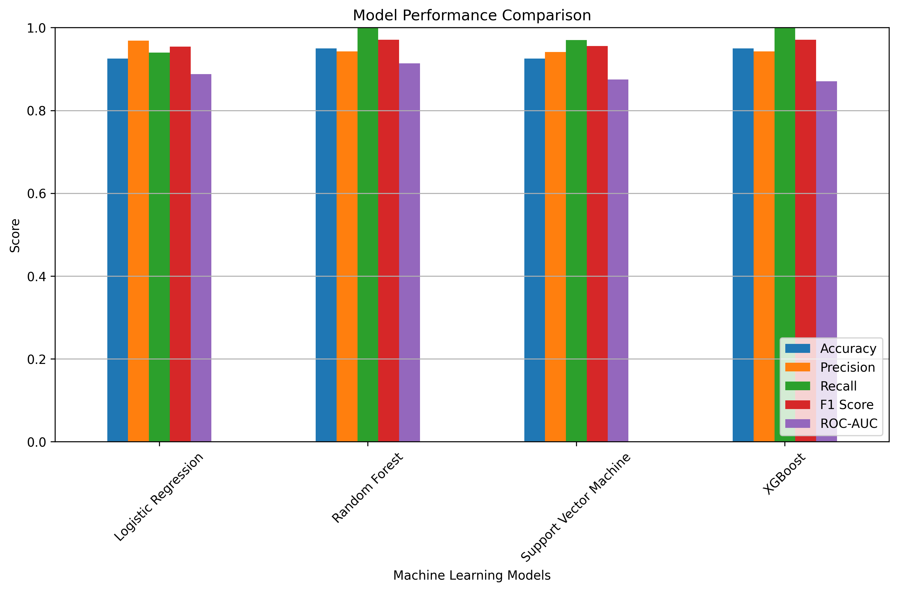
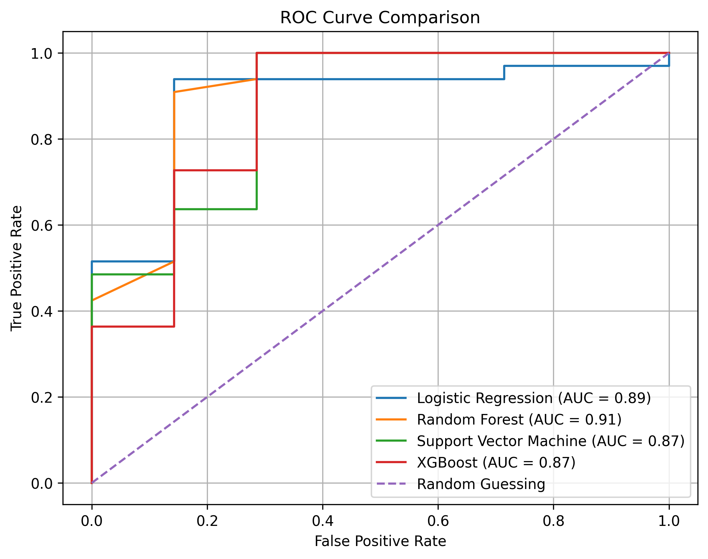
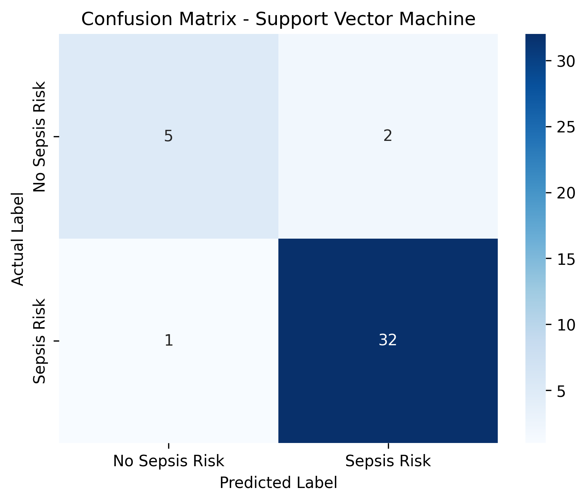
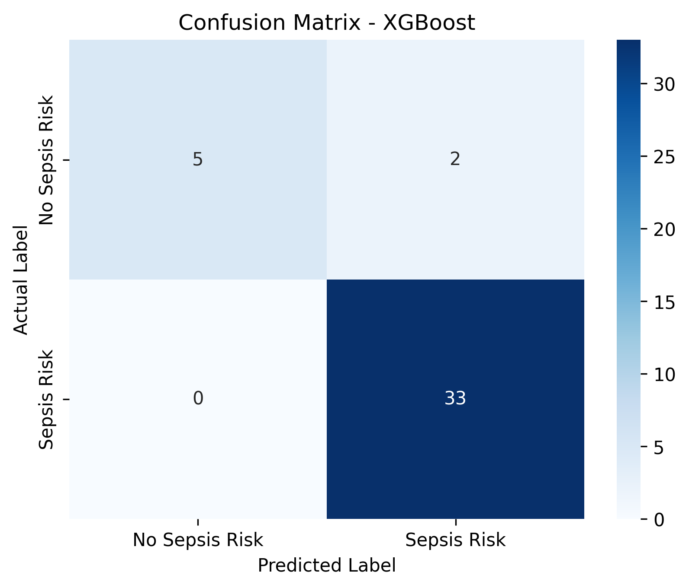
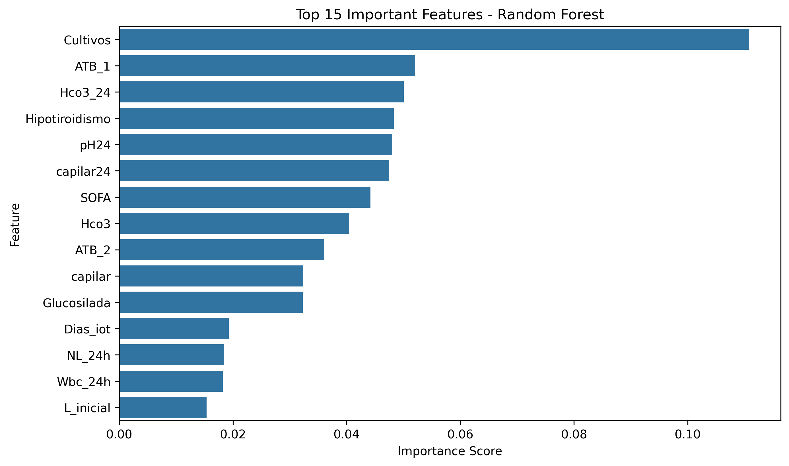

# Early Sepsis Detection from ICU Clinical Data

## Project Overview

* **Objective:**
  This project focuses on building a machine learning model for **early sepsis risk detection** using ICU clinical data.

* **Problem Type:**
  Binary classification problem:

  * `0` = No Sepsis Risk
  * `1` = Sepsis Risk

* **Goal:**
  The goal is to predict whether a patient is at risk of sepsis using clinical, laboratory, and patient-related features.

---

## Dataset

* **Dataset name:**
  `Sepsis_def.csv`

* **Dataset size:**

  * 200 patient records
  * 97 original columns

* **Data type:**
  ICU clinical data containing patient details, laboratory values, treatment-related features, and clinical outcomes.

* **Target variable:**
  The original `Sepsis` column was converted into a binary target variable named `Sepsis_Risk`.

---

## Project Workflow

* Data loading and exploration
* Missing value checking
* Target variable creation
* Removal of non-useful and leakage-related columns
* Train-test split
* Feature scaling using StandardScaler
* Class imbalance handling using SMOTE
* Model training
* Model evaluation and comparison
* Confusion matrix visualization
* ROC curve comparison
* Feature importance analysis
* Saving final model and results

---

## Machine Learning Models Used

* Logistic Regression
* Random Forest Classifier
* Support Vector Machine
* XGBoost Classifier

---

## Best Performing Model

* **Selected model:**
  Random Forest Classifier

* **Reason for selection:**
  Random Forest achieved strong performance across:

  * Accuracy
  * Recall
  * F1-score
  * ROC-AUC score
  * Confusion matrix results

* **Clinical importance:**
  Recall was considered especially important because missing a sepsis-risk patient can be dangerous.

---

## Results Summary

| Model                  | Accuracy | Precision | Recall | F1 Score | ROC-AUC |
| ---------------------- | -------: | --------: | -----: | -------: | ------: |
| Logistic Regression    |    0.925 |     0.969 |  0.939 |    0.954 |   0.887 |
| Random Forest          |    0.950 |     0.943 |  1.000 |    0.971 |   0.913 |
| Support Vector Machine |    0.925 |     0.941 |  0.970 |    0.955 |   0.874 |
| XGBoost                |    0.950 |     0.943 |  1.000 |    0.971 |   0.870 |

---

## Visual Results

### Model Performance Comparison



---

### ROC Curve Comparison



---

### Confusion Matrices

#### Logistic Regression


#### Random Forest


#### Support Vector Machine



#### XGBoost



---

### Feature Importance



---

## Key Findings

* Random Forest achieved the highest ROC-AUC score.
* Random Forest and XGBoost correctly identified all sepsis-risk patients in the test set.
* Random Forest was selected as the final model because it had the strongest overall balance of performance.
* Feature importance analysis showed which clinical features contributed most to the prediction.

---

## Important Note

* This project is for educational and portfolio purposes.
* The dataset contains only 200 records, so results should be interpreted carefully.
* More data and clinical validation would be required before using this model in a real healthcare setting.

---

## Saved Outputs

The following files are saved:

```text
models/random_forest_sepsis_model.pkl
models/scaler.pkl
results/model_comparison_results.csv
results/feature_importance.csv
results/model_performance_comparison.png
results/roc_curve_comparison.png
results/feature_importance.png
results/confusion_matrix_Logistic_Regression.png
results/confusion_matrix_Random_Forest.png
results/confusion_matrix_Support_Vector_Machine.png
results/confusion_matrix_XGBoost.png
```

---

## Technologies Used

* Python
* Pandas
* NumPy
* Matplotlib
* Seaborn
* Scikit-learn
* XGBoost
* Imbalanced-learn
* Joblib
* Jupyter Notebook

---

## Project Structure

```text
Early-Sepsis-Detection-ICU-Data/
│
├── data/
│   └── Sepsis_def.csv
│
├── notebooks/
│   └── early_sepsis_detection.ipynb
│
├── models/
│   ├── random_forest_sepsis_model.pkl
│   └── scaler.pkl
│
├── results/
│   ├── model_comparison_results.csv
│   ├── feature_importance.csv
│   ├── model_performance_comparison.png
│   ├── roc_curve_comparison.png
│   ├── feature_importance.png
│   ├── confusion_matrix_Logistic_Regression.png
│   ├── confusion_matrix_Random_Forest.png
│   ├── confusion_matrix_Support_Vector_Machine.png
│   └── confusion_matrix_XGBoost.png
│
├── src/
│   └── README.md
│
├── README.md
├── requirements.txt
└── .gitignore
```

---

## How to Run This Project

1. Clone the repository:

```bash
git clone https://github.com/mairaasim214-collab/Early-Sepsis-Detection-ICU-Data.git
```

2. Move into the project folder:

```bash
cd Early-Sepsis-Detection-ICU-Data
```

3. Install the required libraries:

```bash
pip install -r requirements.txt
```

4. Open the notebook:

```bash
jupyter notebook notebooks/early_sepsis_detection.ipynb
```

---

## Author

**Maira Asim**

Computer Engineering Graduate | Machine Learning & AI Enthusiast
